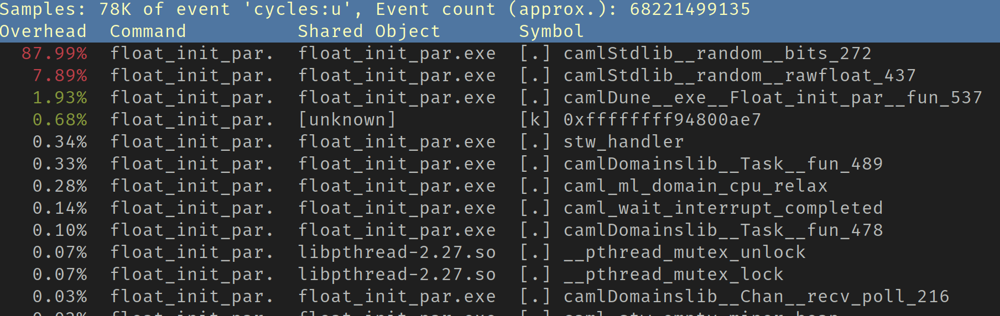
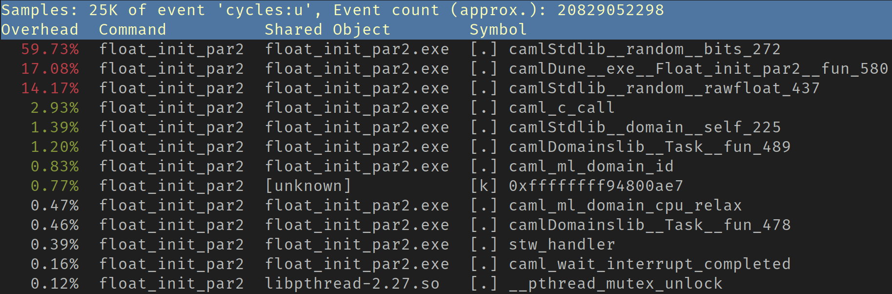
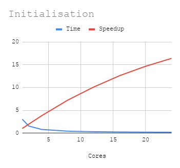
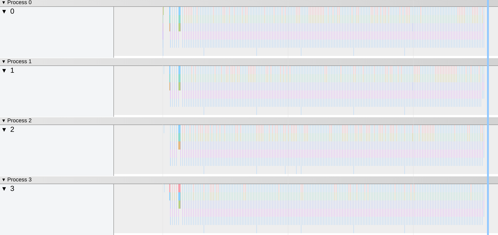
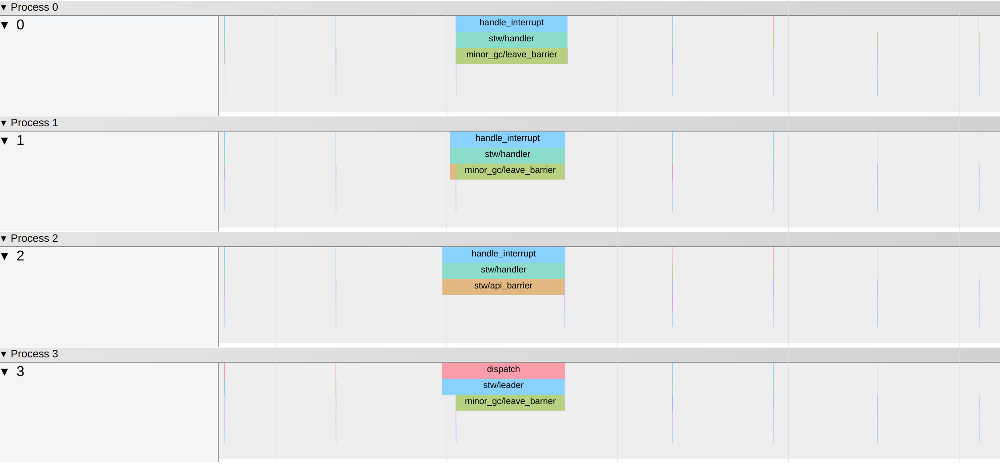
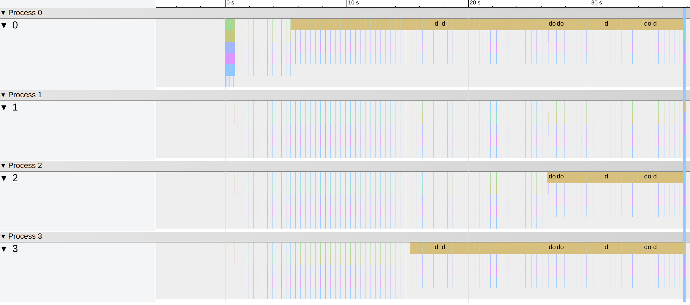
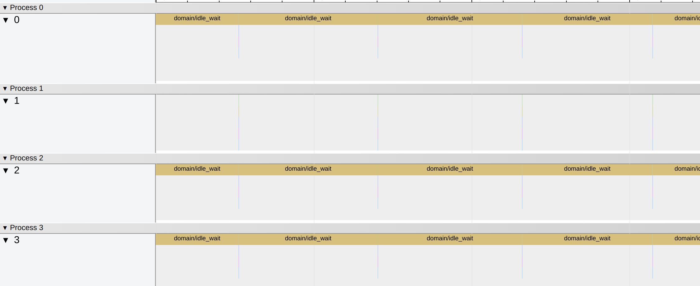

# Parallel programming in Multicore OCaml

This tutorial will help you get started with writing parallel programs in
Multicore OCaml. All the code examples along with their corresponding dune file
are available in the `code/` directory. The tutorial is organised into the
following sections:

- [Introduction](#introduction)
  * [Installation](#installation)
  * [Compatibility with existing code](#compatibility-with-existing-code)
- [Domains](#domains)
- [Domainslib](#domainslib)
  * [Task pool](#task-pool)
  * [Parallel for](#parallel-for)
  * [Async-Await](#async-await)
    + [Fibonacci numbers in parallel](#fibonacci-numbers-in-parallel)
- [Channels](#channels)
  * [Bounded Channels](#bounded-channels)
  * [Task Distribution using Channels](#task-distribution-using-channels)
- [Profiling your code](#profiling-your-code)
  * [Perf](#perf)
  * [Eventlog](#eventlog)

# Introduction

Multicore OCaml is an extension of OCaml with native support for Shared Memory
Parallelism through `Domains` and Concurrency through `Algebraic effects`. It is
slowly, but steadily being merged to trunk OCaml. Domains-only multicore is
expected to land first followed by Algebraic effects.

**Concurrency** is how we partition multiple computations such that they can
run in overlapping time periods rather than strictly sequentially.
**Parallelism** is the act of running multiple computations simultaneously,
primarily by using multiple cores on a multicore machine. The multicore wiki
has [comprehensive notes](https://github.com/ocaml-multicore/ocaml-multicore/wiki/Concurrency-and-parallelism-design-notes) on the design decisions and
current status of concurrency and parallelism in Multicore OCaml.

The Multicore OCaml compiler ships with a concurrent major and a stop-the-world
minor garbage collectors. The parallel minor collector doesn't require any
changes to the C API, thereby not breaking any associated code with C API. The
multicore bits of the compiler are actively being integrated with the mainstream
OCaml compiler with [some PRs already merged into
trunk](https://github.com/ocaml/ocaml/pulls?q=is%3Apr+label%3Amulticore-prerequisite+).
OCaml 5.0 is expected to land with support for shared-memory parallelism and
algebraic effects in later releases. A historical variant of the multicore minor
garbage collector is the concurrent minor collector. Benchmarking experiments
showed better results in terms of throughput and latency on the stop-the-world
parallel minor collector, hence that's chosen to be the default minor collector
on Multicore OCaml and the concurrent minor collector is not actively developed.
For the intrigued, details on the design and evaluation of the Multicore GC and
compiler are in our
[academic publications](https://github.com/ocaml-multicore/ocaml-multicore/wiki#articles).

The Multicore ecosystem also has the following libraries to complement the
compiler.

* [**Domainslib**](https://github.com/ocaml-multicore/domainslib): Data and
control structures for parallel programming.
* [**Lockfree**](https://github.com/ocaml-multicore/lockfree): [Lock-free](https://en.wikipedia.org/wiki/Non-blocking_algorithm#Lock-freedom) data
structures (list, hash, bag and queue).
* [**Reagents**](https://github.com/ocaml-multicore/reagents): Composable lock-
free concurrency library for expressing fine grained parallel programs on
Multicore OCaml
* [**Kcas**](https://github.com/ocaml-multicore/kcas): Multi-word compare and
swap library

This tutorial intends to take the reader through ways in which one can
profitably write parallel programs in Multicore OCaml. The reader is assumed to
be familiar with OCaml, if not, they are encouraged to read [Real World
OCaml](https://dev.realworldocaml.org/toc.html). The effect handlers story is
not touched upon here, for anyone interested, do check out this
[tutorial](https://github.com/ocamllabs/ocaml-effects-tutorial) and
[examples](https://github.com/ocaml-multicore/effects-examples).

## Installation

The latest version 4.12 of the Multicore compiler can be obtained from
[multicore-opam](https://github.com/ocaml-multicore/multicore-opam).
Installation instructions for the Multicore compiler and parallel programming
library `domainslib` can be found
[here](https://github.com/ocaml-multicore/multicore-opam#install-multicore-ocaml).

It will also be useful to install `utop` on your Multicore switch.
`opam install utop` should work out of the box.

## Compiler variants and compatibility

**`4.12.0+domains`**: With support for domains-only parallelism. This branch is
close to what’s intended to be shipped with OCaml 5.0. Maintains compatibility
with `ppx` and related libraries.

**`4.12.0+domains+effects`**: With support for parallelism and algebraic effects.

# Domains

Domains are the basic unit of parallelism in Multicore OCaml.

```ocaml
let square n = n * n

let x = 5
let y = 10

let _ =
  let d = Domain.spawn (fun _ -> square x) in
  let sy = square y in
  let sx = Domain.join d in
  Printf.printf "x = %d, y = %d\n" sx sy
```
`Domain.spawn` creates a new process of execution that runs along with the
current domain.

`Domain.join d` blocks until the domain `d` runs to completion. If the domain
returns a result after its execution, `Domain.join d` also returns that value.
If it raises an uncaught exception, that is thrown. When the parent domain
terminates, all other domains also terminate. To ensure that a domain runs to
completion, we have to join the domain.

Note that the square of x is computed in a new domain and that of y in the
parent domain.

Let us create its corresponding dune file and run this code.

```
(executable
  (name square_domain)
  (modules square_domain))
```

Make sure to use a multicore switch to build this and all other subsequent
examples we encounter in this tutorial.

To execute the code:

```
$ dune build square_domain.exe
$ ./_build/default/square_domain.exe
x = 25, y = 100
```

So, as expected the squares of x and y are 25 and 100.

**Common error message**

Some common errors one might encounter while compiling Multicore code are

```
Error: Unbound module Domain
```

```
Error: Unbound module Atomic
```

```
Error: Library "domainslib" not found.
```

These errors usually mean that the compiler switch used to compile the code is
not a multicore switch. Using a multicore compiler variant should resolve them.

# Domainslib

Domainslib is a parallel programming library for Multicore OCaml. It provides
the following APIs which enable easy ways to parallelise OCaml code with few
modifications to sequential code:

* **Task**: Work stealing task pool with async/await parallelism and parallel_{for, scan}.
* **Channels**: Multiple Producer Multiple Consumer channels which come in two flavours, bounded and unbounded.

Domainslib is effective in scaling the performance when parallelisable
workloads are available.

## Task pool

In the Domains section, we saw how to run programs on multiple cores by
spawning new domains. Often times we will find ourselves spawning and joining
new domains numerous times in the same program, if we were to use that approach
for executing code in parallel. Creating new domains is an expensive operation
which we should attempt to limit however much possible. Task pool lets us to
execute all parallel workloads in the same set of domains which are spawned at
the beginning of the program. Let us see how to get task pools working.

Note: run `#require "domainslib"` with the hash before this, if you are running
this on `utop`.

```ocaml
# open Domainslib

# let pool = Task.setup_pool ~num_additional_domains:3
val pool : Task.pool = <abstr>
```
We have created a new task pool with three new domains. The parent domain is
also part of this pool, thus making it a pool of four domains. After the pool is
setup, we can use this pool to execute all tasks we want to run in parallel. The
`setup_pool` function requires us to specify the number of new domains to be
spawned in the task pool. The ideal number of domains to initiate a task pool
with is equal to the number of cores available. Since the parent domain also
takes part in the pool, the `num_additional_domains` parameter should be one
less than the number of available cores.

Closing the task pool after execution of all tasks, though not strictly
necessary, is highly recommended. This can be done as

```ocaml
# Task.teardown_pool pool
```

Now the pool is deactivated and no longer usable, so make sure to do this only
after all tasks are done.

## Parallel for

`parallel_for` is a powerful primitive in the Task API which can be used to
parallelise computations that use for loops. It can scale well with very little
change to the sequential code.

Let us consider the example of matrix multiplication.

First, let us write down the sequential version of a function which performs
matrix multiplication of two matrices and returns the result.

```ocaml
let matrix_multiply a b =
  let i_n = Array.length a in
  let j_n = Array.length b.(0) in
  let k_n = Array.length b in
  let res = Array.make_matrix i_n j_n 0 in
  for i = 0 to i_n - 1 do
    for j = 0 to j_n - 1 do
      for k = 0 to k_n - 1 do
        res.(i).(j) <- res.(i).(j) + a.(i).(k) * b.(k).(j)
      done
    done
  done;
  res
```

To make this function run in parallel, one might be inclined to spawn a new
domain for every iteration in the loop, which would look like:

```ocaml
  let domains = Array.init i_n (fun i ->
    Domain.spawn(fun _ ->
      for j = 0 to j_n - 1 do
        for k = 0 to k_n - 1 do
          res.(i).(j) <- res.(i).(j) + a.(i).(k) * b.(k).(j)
        done
      done)) in
   Array.iter Domain.join domains
```
This will be *disastrous* in terms of performance majorly due to the fact that
spawning a new domain is an expensive operation. What instead task pool offers
us is, a finite set of available domains, which can be used to run your
computations in parallel.

Arrays are usually more efficient compared with lists in the context of
Multicore OCaml. Although they are not generally favoured in functional
programming, using arrays for the sake of efficiency is a reasonable trade-off.

A better way to parallelise matrix multiplication with the help of a
`parallel_for`.

```ocaml
let parallel_matrix_multiply pool a b =
  let i_n = Array.length a in
  let j_n = Array.length b.(0) in
  let k_n = Array.length b in
  let res = Array.make_matrix i_n j_n 0 in

  Task.parallel_for pool ~start:0 ~finish:(i_n - 1) ~body:(fun i ->
    for j = 0 to j_n - 1 do
      for k = 0 to k_n - 1 do
        res.(i).(j) <- res.(i).(j) + a.(i).(k) * b.(k).(j)
      done
    done);
  res
```

We can observe quite a few differences between the parallel and sequential
versions. The parallel version takes an additional parameter `pool`, it is
because, the `parallel_for` executes the for loop on the domains present in
that task pool. While it is possible to initialise a task pool inside the
function itself, it is always better to have a single task pool used across the
entire program. As mentioned earlier, this is to minimise the cost involved in
spawning a new domain. It is also possible to create a global task pool and use
it across, but for the sake of being able to reason better about your code, it
is recommended to use it as a function parameter.

We shall examine the parameters of `parallel_for`. It takes in `pool` as
discussed earlier, `start` and `finish` as the names suggset are the starting
and ending values of the loop iterations, `body` contains the actual loop body
to be executed.

Parallel for also has an optional parameter `chunk_size`. It determines the
granularity of tasks when executing them on multiple domains. If no parameter
is given for `chunk size`, a default chunk size is determined which performs
well in most cases. Only if the default chunk size doesn't work well, is it
recommended to experiment with different chunk sizes. The ideal `chunk_size`
depends on a combination of factors:

* **Nature of the loop:** There are two things to consider pertaining to the
loop while deciding on a `chunk_size` to use, the *number of iterations* in the
loop and *amount of time* each iteration takes. If the amount of time taken by
every iteration is roughly equal, then the `chunk_size` could be number of
iterations divided by the number of cores. On the other hand, if the amount of
time taken is different for every iteration, the chunks should be smaller. If
the total number of iterations is a sizeable number, a `chunk_size` like 32 or
16 is safe to use, whearas if the number of iterations is low, like say 10, a
`chunk_size` of 1 would perform best.

* **Machine:** Optimal chunk size varies across machines and it is recommended
to experiment with a range of values to find out what works best on yours.

### Speedup

Let us find how the parallel matrix multiplication scales on multiple cores.

**Speedup**

The speedup vs core is enumerated below for input matrices of size 1024x1024.

| Cores | Time (s) | Speedup     |
|-------|----------|-------------|
| 1     | 9.172    | 1           |
| 2     | 4.692    | 1.954816709 |
| 4     | 2.293    | 4           |
| 8     | 1.196    | 7.668896321 |
| 12    | 0.854    | 10.74004684 |
| 16    | 0.76     | 12.06842105 |
| 20    | 0.66     | 13.8969697  |
| 24    | 0.587    | 15.62521295 |


We have achieved a speedup of 16 with the help of a `parallel_for`. It is very
much possible to achieve linear speedups when parallelisable workloads are
available.

Note that the performance of parallel code heavily depends on the machine, some
machine settings specific to Linux systems for obtaining optimal results are
described [here](https://github.com/ocaml-bench/ocaml_bench_scripts#notes-on-hardware-and-os-settings-for-linux-benchmarking).

### Properties and Caveats of `parallel_for`

#### Implicit Barrier

The `parallel_for` has an implicit barrier, meaning other tasks if any,
waiting to be executed after in the same pool will start only after all chunks
in the `parallel_for` are done. So, we need not worry about creating and
inserting barriers explicitly between two `parallel_for`s or some other
operation after a `parallel_for`. Consider this scenario: we have three
matrices `m1`, `m2` and `m3`. We want to compute `(m1*m2) * m3` where `*`
indicates matrix multiplication. For the sake of simplicity, let us assume all
three are square matrices of the same size.

```ocaml
let parallel_matrix_multiply_3 pool m1 m2 m3 =
  let size = Array.length m1 in
  let t = Array.make_matrix size size 0 in (* stores m1*m2 *)
  let res = Array.make_matrix size size 0 in

  Task.parallel_for pool ~start:0 ~finish:(size - 1) ~body:(fun i ->
    for j = 0 to size - 1 do
      for k = 0 to size - 1 do
        t.(i).(j) <- t.(i).(j) + m1.(i).(k) * m2.(k).(j)
      done
    done);

  Task.parallel_for pool ~start:0 ~finish:(size - 1) ~body:(fun i ->
    for j = 0 to size - 1 do
      for k = 0 to size - 1 do
        res.(i).(j) <- res.(i).(j) + t.(i).(k) * m3.(k).(j)
      done
    done);

    res
```

In a hypothetical situation where `parallel_for` did not have an implicit
barrier, in the example above, it is very likely that the computation of `res`
would not be correct. Since, we already have an implicit barrier, we will get
the right computation.

#### Order of execution

```
for i = start to finish do
  <body>
done
```

A sequential for loop, like the one above, runs its iterations in the exact
same order, from `start` to `finish`. In case of `parallel_for` the order of
execution is arbitrary and varies between two runs of the exact same code. If
the iteration order is important for your code to work as desired, it is
advisable to use `parallel_for` with some caution.

#### Dependencies within the loop

If there are any dependencies within the loop, such as current iteration
depends on the result of a previous iteration, odds are very high that the
correctness of the code no longer holds if `parallel_for` is used. Task API has
a primitive `parallel_scan` which might come in handy in scenarios like this.

## Async-Await

Parallel for lets easily parallelise iterative tasks. Async-Await offers more
flexibility to execute tasks in parallel which is especially useful in
recursive functions. We have earlier seen how to setup and tear down a task
pool. The Task API also has the facility to run specific tasks on a task pool.

### Fibonacci numbers in parallel

We are going to calculate fibonacci numbers in parallel.
First let us write a sequential function to calculate fibonacci numbers. This
is a naive fibonacci function without tail-recursion.

```ocaml
let rec fib n =
if n < 2 then 1
else fib (n - 1) + fib (n - 2)
```

Observe that the two operations in recursive case`fib (n - 1)` and `fib (n -
2)` do not have any mutual dependencies which makes it convenient for us to
compute them in parallel. Essentially, we can calculate `fib (n - 1)` and `fib
(n - 2)` in parallel and add the results to get the answer.

We can do this by spawning a new domain for performing calculation and joining
it to obtain the result. We have to be careful here to not spawn more domains
than number of cores available.

```ocaml
let rec fib_par n d =
  if d <= 1 then fib n
  else
    let a = fib_par (n-1) (d-1) in
    let b = Domain.spawn (fun _ -> fib_par (n-2) (d-1)) in
    a + Domain.join b
```
We can as well use task pools to execute tasks asynchronously, which is less tedious and scales better.

```ocaml
let rec fib_par pool n =
  if n <= 40 then fib n
  else
    let a = Task.async pool (fun _ -> fib_par pool (n-1)) in
    let b = Task.async pool (fun _ -> fib_par pool (n-2)) in
    Task.await pool a + Task.await pool b
```

We can note some differences from the sequential version of fibonacci.

* `pool` is an additional parameter for the same reasons in `parallel_for`.

* `if n <= 40 then fib n` -> when the input is less than 40, we are running the
sequential `fib` function. When the input number is small enough, it is better
off to perform the calculations sequentially. We have taken `40` as the
threshold here, some experimentation would help you to find a good enough
threshold, below which the computation can be done sequentially.

* `Task.async` and `Task.await` are used to run the tasks in parallel.
  + **Task.async** executes the task in the pool asynchronously and it returns
  a promise, a computation that is not yet complete. After the execution runs
  to completion, its result will be stored in the promise.

  + **Task.await** waits for the promise to complete its execution and once it
  is done, the result of the task is returned. In case the task raises an
  uncaught exception, `await` also raises the same exception.


# Channels

## Bounded Channels

Channels act as medium to communicate data between domains. They can be shared
between multiple sending and receiving domains. Channels in Multicore OCaml
come in two flavours:

* **Bounded**: buffered channels with a fixed size. A channel with buffer size
0 corresponds to a synchronised channel, buffer size 1 gives the `MVar`
structure. Bounded channels can be created with any buffer size.

* **Unbounded**: unbounded channels have no limit on the number of objects they
can hold, they are only constrained by memory availability.

```ocaml
open Domainslib

let c = Chan.make_bounded 0

let _ =
  let send = Domain.spawn(fun _ -> Chan.send c "hello") in
  let msg =  Chan.recv c in
  Domain.join send;
  Printf.printf "Message: %s\n" msg
```

In the above example, we have a bounded channel `c` of size 0. Any `send` to
the channel is blocked until a corresponding `recv` is encounterd. So, if we
remove the `recv` in this example, the program would be blocking indefinitely.

```ocaml
open Domainslib

let c = Chan.make_bounded 0

let _ =
  let send = Domain.spawn(fun _ -> Chan.send c "hello") in
  Domain.join send;
```

The above example would be essentially blocking indefinitely because the `send`
does not have a corresponding receive. If we instead create a bounded channel
with buffer size n, it can store up to [n] objects in the channel without a
corresponding receive, exceeding which the sending would block. We can try it
with the same example as above just by changing the buffer size to 1.

```ocaml
open Domainslib

let c = Chan.make_bounded 1

let _ =
  let send = Domain.spawn(fun _ -> Chan.send c "hello") in
  Domain.join send;
```

Now, the send does not block anymore.

If you do not want to block in send or recv, `send_poll` and `recv_poll` might
come in handy. They return a boolean value, if the operation was successful we
get a `true`, otherwise a `false`.

```ocaml
open Domainslib

let c = Chan.make_bounded 0

let _ =
  let send = Domain.spawn(fun _ ->
          let b = Chan.send_poll c "hello" in
          Printf.printf "%B\n" b) in
  Domain.join send;
```

Since the buffer size is 0 and the channel cannot hold any object, this program
prints a false,

The same channel may be shared by multiple sending and receiving domains.

```ocaml
open Domainslib

let num_domains = try int_of_string Sys.argv.(1) with _ -> 4

let c = Chan.make_bounded num_domains

let send c =
  Printf.printf "Sending from: %d\n" (Domain.self () :> int);
  Chan.send c "howdy!"

let recv c =
  Printf.printf "Receiving at: %d\n" (Domain.self () :> int);
  Chan.recv c |> ignore

let _ =
  let senders = Array.init num_domains
                  (fun _ -> Domain.spawn(fun _ -> send c )) in
  let receivers = Array.init num_domains
                  (fun _ -> Domain.spawn(fun _ -> recv c)) in

  Array.iter Domain.join senders;
  Array.iter Domain.join receivers
```

`(Domain.self () :> int)` returns the id of current domain.

## Task Distribution using Channels

Now that we have some idea about how channels work, let us consider a more
realistic example. We will see how to write a generic task distributor that
executes tasks on multiple domains.

```ocaml
module C = Domainslib.Chan
let num_domains = try int_of_string Sys.argv.(1) with _ -> 4
let n = try int_of_string Sys.argv.(2) with _ -> 100

type 'a message = Task of 'a | Quit

let c = C.make_unbounded ()

let create_work tasks =
  Array.iter (fun t -> C.send c (Task t)) tasks;
  for _ = 1 to num_domains do
    C.send c Quit
  done

let rec worker f () =
  match C.recv c with
  | Task a ->
      f a;
      worker f ()
  | Quit -> ()

let _ =
  let tasks = Array.init n (fun i -> i) in
  create_work tasks ;
  let factorial n =
    let rec aux n acc =
        if (n > 0) then aux (n-1) (acc*n)
        else acc in
    aux n 1
  in
  let results = Array.make n 0 in
  let update r i = r.(i) <- factorial i in
  let domains = Array.init (num_domains - 1)
              (fun _ -> Domain.spawn(worker (update results))) in
  worker (update results) ();
  Array.iter Domain.join domains;
  Array.iter (Printf.printf "%d ") results
```

We have created an unbounded channel `c` which will act as a store for all the
tasks. We'll pay attention to two functions here: `create_work` and `worker`.

`create_work` takes an array of tasks and pushes all elements of tasks to the
channel `c`. The `worker` function receives tasks from the channel and executes
a function f with the received task as parameter. It keeps recursing until it
encounters a Quit message, which is why we send `Quit` messages to the channel,
indicating that the worker can terminate.

We can use this template to run any task on multiple cores, by running the
`worker` function on all the domains. This example runs a naive factorial
function. The granularity of a task could be tweaked as well, by changing it in
the worker function, for instance, worker can run for a range of tasks instead
of single one.


# Profiling your code

While writing parallel programs in Multicore OCaml, it is quite common to
encounter overheads which might deteriorate our code's performance. This
section describes ways to discover those overheads and fix them. Linux `perf`
and `eventlog` in the Multicore runtime are particularly useful tools for
performance debugging. In this section, we will be using them for performance
debugging. Let's do that with the help of an example.

## Perf

Linux perf is a tool that has proved to be very useful to profile Multicore
OCaml code.

**Profiling serial code**

Profiling serial code can help us identify parts of code which can potentially
benefit from parallelising. Let's do it for the sequential version of matrix
multiplication.

```
perf record --call-graph dwarf ./matrix_multiplication.exe 1024
```

We get a profile that tells us how much time is spent in the `matrix_multiply`
function which we wanted to parallelise. What we also need to keep in mind, is
that if a lot more time is spent outside the function we'd like to parallelise,
the maximum speedup we could achieve would be lower.

Profiling serial code can help us discover the hotspots where we might want to
introduce parallelism.

```
Samples: 51K of event 'cycles:u', Event count (approx.): 28590830181
  Children      Self  Command     Shared Object     Symbol
+   99.84%     0.00%  matmul.exe  matmul.exe        [.] caml_start_program
+   99.84%     0.00%  matmul.exe  matmul.exe        [.] caml_program
+   99.84%     0.00%  matmul.exe  matmul.exe        [.] camlDune__exe__Matmul__entry
+   99.32%    99.31%  matmul.exe  matmul.exe        [.] camlDune__exe__Matmul__matrix_multiply_211
+    0.57%     0.04%  matmul.exe  matmul.exe        [.] camlStdlib__array__init_104
     0.47%     0.37%  matmul.exe  matmul.exe        [.] camlStdlib__random__intaux_278
```


### Overheads in parallel code

Perf can be helpful in identifying overheads in your parallel code. We'll see
one such example here where we improve the performance by removing overheads.

**Parallel initialisation of a float array with random numbers**

Array initialisation using standard library's `Array.init` is sequential.
Parallel workloads in a program would scale according to the number of cores
used, whearas the initialisation takes the same amount of time in all cases.
This might become a bottleneck for parallel workloads.

For float arrays, we have `Array.create_float` which creates a fresh float
array. We can use this to allocate an array and do the initialisation in
parallel. Let us do the initialisation of a float array with random numbers in
parallel.

**Naive implementation**

This is a naive implementation, which will initialise all elements of the array
with a Random number.

```ocaml
open Domainslib

let num_domains = try int_of_string Sys.argv.(1) with _ -> 4
let n = try int_of_string Sys.argv.(2) with _ -> 100000
let a = Array.create_float n

let _ =
  let pool = Task.setup_pool ~num_additional_domains:(num_domains - 1) in
  Task.parallel_for pool ~start:0
  ~finish:(n - 1) ~body:(fun i -> Array.set a i (Random.float 1000.));
  Task.teardown_pool pool
```

Let us measure how it scales.

| #Cores | Time(s) |
|--------|---------|
| 1      | 3.136   |
| 2      | 10.19   |
| 4      | 11.815  |

When we had expected to see speedup executing in multiple cores, what we see
here instead is the code slows down as the number of cores increase. There is
something wrong with the code which doesn't meet the eye.

We shall profile the performance with perf linux profiler.

```
$ perf record ./_build/default/float_init_par.exe 4 100_000_000
$ perf report
```

Perf report would look something like this:



We can see the overhead at Random bits is a whooping 87.99%. Typically there is
no one cause that we can attribute to such overheads, since they are very
specific to the program. It might need a little careful inspection to find out
what is causing them. In this case, the Random module is sharing same state
amongst all the domains, which is causing contention when multiple domains are
trying to access it at a time.

To overcome that, we shall use a different state for every domain so that there
is no contention due to shared state.

```ocaml
module T = Domainslib.Task
let n = try int_of_string Sys.argv.(2) with _ -> 1000
let num_domains = try int_of_string Sys.argv.(1) with _ -> 4

let arr = Array.create_float n

let _ =
  let domains = T.setup_pool ~num_additional_domains:(num_domains - 1) in
  let states = Array.init num_domains (fun _ -> Random.State.make_self_init()) in
  T.parallel_for domains ~start:0 ~finish:(n-1)
  ~body:(fun i ->
    let d = (Domain.self() :> int) mod num_domains in
    Array.unsafe_set arr i (Random.State.float states.(d) 100. ))
```

We have created `num_domains` different Random States, each to be used by a different Domain. This might come across as a hack, but if those hacks help us to achieve better performance, there is no harm in using them, as long as the correctness is intact.

We shall run this on multiple cores.

| #Cores | Time(s) |
|--------|---------|
| 1      | 3.828   |
| 2      | 3.641   |
| 4      | 3.119   |

Examining the times, though it is not as bad as the previous case, but it is
not close to what we would expect. Let us see the perf report:



The overheads at Random bits is less than the previous case, but it is still
quite high at 59.73%. We have used a separate Random State for every domain, so
the overheads are not caused by any shared state. But if we look closely, the
Random states are all allocated by the same domain in an array with small
number of elements, possibly located close to each other in physical memory.
When multiple domains try to access them, they might possibly share cache
lines, what's termed as `false sharing`. We can confirm our suspicion with the
help of `perf c2c` on Intel machines.

```
$ perf c2c record _build/default/float_init_par2.exe 4 100_000_000
$ perf c2c report

Shared Data Cache Line Table     (2 entries, sorted on Total HITMs)
       ----------- Cacheline ----------    Total      Tot  ----- LLC Load Hitm -----  ---- Store Reference ----  --- Loa
Index             Address  Node  PA cnt  records     Hitm    Total      Lcl      Rmt    Total    L1Hit   L1Miss       Lc
    0      0x7f2bf49d7dc0     0   11473    13008   94.23%     1306     1306        0     1560      595      965        ◆
    1      0x7f2bf49a7b80     0     271      368    5.48%       76       76        0      123       76       47
```

As evident from the report, there's quite a lot of false sharing happening in
the code. To eliminate false sharing, we can allocate the Random state in the
domain that is going to use it. This way, the states will be allocated with
memory locations far from each other.

```ocaml
module T = Domainslib.Task
let n = try int_of_string Sys.argv.(2) with _ -> 1000
let num_domains = try int_of_string Sys.argv.(1) with _ -> 4

let arr = Array.create_float n

let init_part s e arr =
    let my_state = Random.State.make_self_init () in
    for i = s to e do
      Array.unsafe_set arr i (Random.State.float my_state 100.)
    done

let _ =
  let domains = T.setup_pool ~num_additional_domains:(num_domains - 1) in
  T.parallel_for domains ~chunk_size:1 ~start:0 ~finish:(num_domains - 1)
  ~body:(fun i -> init_part (i * n / num_domains) ((i+1) * n / num_domains - 1) arr);
  T.teardown_pool domains
```

Now the results are

| Cores | Time  | Speedup     |
|-------|-------|-------------|
| 1     | 3.055 | 1           |
| 2     | 1.552 | 1.968427835 |
| 4     | 0.799 | 3.823529412 |
| 8     | 0.422 | 7.239336493 |
| 12    | 0.302 | 10.11589404 |
| 16    | 0.242 | 12.62396694 |
| 20    | 0.208 | 14.6875     |
| 24    | 0.186 | 16.42473118 |




So, in this process, we have essentially identified bottlenecks for scaling and
eliminated them to achieve better speedups. For more details on profiling with
perf, please refer [these notes](https://github.com/ocaml-bench/notes/blob/master/profiling_notes.md).

## Eventlog

The Multicore runtime has eventlog enabled by default. Eventlog records GC
activity throughout the running of the program. We can generate eventlogs with
OCAMLRUNPARAM `e`:

```
OCAMLRUNPARAM="e" <executable> <arguments>
```

This would generate an eventlog in json format. It will be stored in the
current working directory. The file can be viewed on `chrome://tracing` (or
`brave://tracing`). An eventlog file in `chrome://tracing` looks something like
this:



We can zoom in further to find any GC events causing huge latencies.



There is also a [script](https://github.com/ocaml-multicore/ocaml-multicore/blob/parallel_minor_gc/tools/eventlog_to_latencies.py) available in
`ocaml-multicore/tools` which displays some statistics from the generated eventlog.
It can be invoked as

```
python3 eventlog_to_latencies.py <eventlog>
```

This will display some stats like

```
Mean latency = 33048.10271546635 ns
Max latency = 3590555 ns

## Latency distribution

Percentile, Latency(ns)
10,4887
20,5384
30,5762
40,6298
50,6762
60,7366
70,8401
80,11195
90,15084
95,18888
99,418186
99.9,3587762

## Top slowest events

Latency(ns), Start Timestamp(ns), End TimeStamp(ns), Event, Overhead, Domain ID
3590555, 25535696, 29126251, handle_interrupt, 0, 2
3587762, 25531594, 29119356, dispatch, 0, 3
3360462, 25765906, 29126368, handle_interrupt, 0, 1
3269213, 25925476, 29194689, handle_interrupt, 0, 0
1544112, 11252420, 12796532, dispatch, 0, 3
1539572, 11255922, 12795494, handle_interrupt, 0, 0
1538818, 11256465, 12795283, handle_interrupt, 0, 1
419944, 1064703, 1484647, domain/spawn, 0, 0
418186, 1895401, 2313587, domain/spawn, 0, 0
406474, 1487011, 1893485, domain/spawn, 0, 0
406064, 657246, 1063310, dispatch, 0, 0
199844, 399456161, 399656005, dispatch, 0, 2
197720, 399457883, 399655603, handle_interrupt, 0, 0
197535, 399457879, 399655414, handle_interrupt, 0, 1
185638, 12609615, 12795253, handle_interrupt, 0, 2
76860, 513222912, 513299772, stw/leader, 0, 1
62058, 510995617, 511057675, dispatch, 0, 2
61744, 510994391, 511056135, dispatch, 0, 0
57059, 510998841, 511055900, handle_interrupt, 0, 3
46582, 302806217, 302852799, dispatch, 0, 0
45256, 302807018, 302852274, handle_interrupt, 0, 1
44609, 302807682, 302852291, handle_interrupt, 0, 2
38573, 66232951, 66271524, dispatch, 0, 3
36242, 66235278, 66271520, handle_interrupt, 0, 2
35272, 513264748, 513300020, stw/handler, 0, 3
32050, 19148673, 19180723, dispatch, 0, 3
29817, 305379160, 305408977, dispatch, 0, 1
28746, 513271117, 513299863, stw/handler, 0, 0
27982, 66243537, 66271519, handle_interrupt, 0, 0
27851, 66243628, 66271479, handle_interrupt, 0, 1
27653, 19151760, 19179413, handle_interrupt, 0, 0
27639, 19151690, 19179329, handle_interrupt, 0, 1
```

We can locate the event which causes maximun latency with the help of the
script. Fixing the event may improve the throughput of the program.

### Using eventlog to diagnose imbalance in task distribution

Eventlog can be useful to find imbalance in task distribution, if any
in a parallel program. Imbalance in task distribution essentially means that,
not all domains are provided with equal amount of computation to do. In
effect, some domains take longer than others to finish their computations,
while the idle domains keep waiting. A possible occurence of this is when a sub-
optimal chunk_size is picked in a `parallel_for`.

Time periods when a domain is idle is recorded as `domain/idle_wait` in the
eventlog. Here is an example eventlog generated by a program with unbalanced
task distribution.



If we zoom in further, we see many `domain/idle_wait` events.



So far we have only found that there is an imbalance in task distribution
in the code, we'll need to change our code accordingly to make the task
distribution more balanced, which could increase the speedup.

---

Performace debugging can be quite tricky at times. If you could use some help in
debugging your Multicore OCaml code, feel free to create an issue in the
Multicore OCaml [issue tracker](https://github.com/ocaml-multicore/ocaml-multicore/issues) along with a minimal code example.
